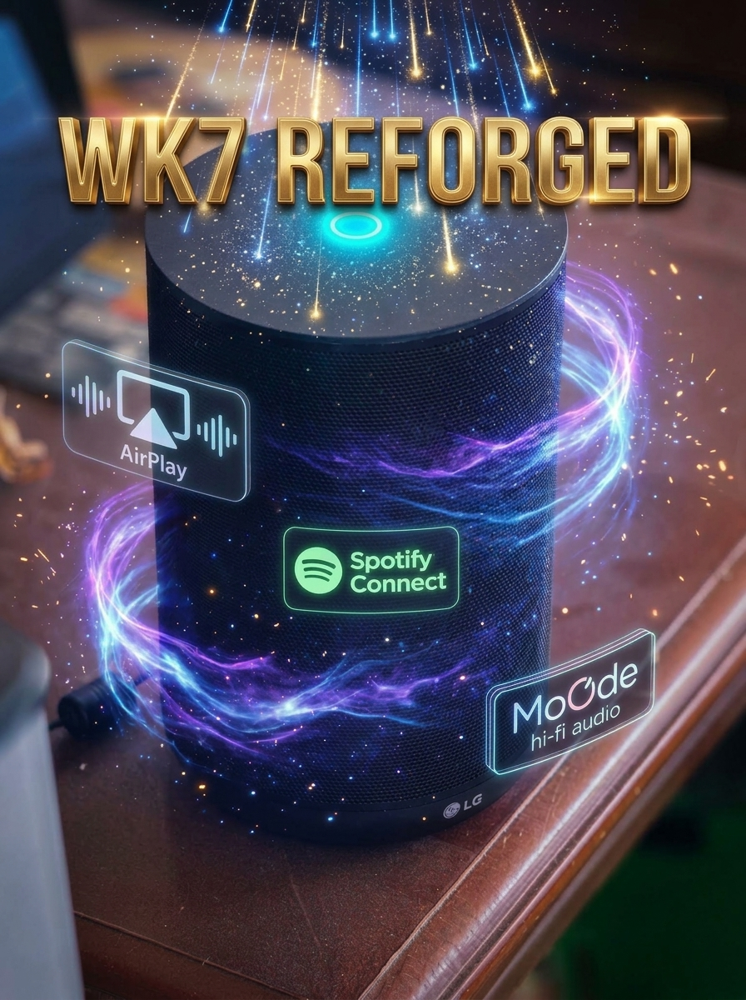

# WK7 Speaker REFORGED – New Custom Software for Some Models

<p align="center">
  
</p>

A lightweight, non-destructive firmware and software stack that brings the **LG WK7 ThinQ** smart speaker back to life as a modern, local-first streaming audio endpoint.

---

## Context: The Rise and Fall of the LG WK7

The **LG WK7 ThinQ** was launched in 2018 as a premium smart speaker featuring high-resolution 24-bit/96kHz audio tuned by British audio pioneer **Meridian Audio**. Under the hood, it ran Google's **Android Things** IoT platform on a Qualcomm APQ8009 SoC, with Google Assistant and Chromecast built-in.

Despite its exceptional acoustic engineering, tight coupling to proprietary cloud ecosystems soon led to total obsolescence:

1. **Platform Abandonment**: Google deprioritized and eventually shut down the Android Things platform entirely in January 2022.
2. **Severed Cloud Services**: Google overhauled its Assistant and Cast infrastructure, rendering the speaker's legacy embedded clients and authentication tokens obsolete.
3. **App Deprecation & Bricking**: LG pulled the companion setup app (`com.lge.smartspeaker`) and shut down backend servers. Any network change or factory reset trapped devices in an unconfigurable initialization loop—turning high-end hardware into silent electronic waste.

<p align="center">
  
</p>

**WK7 Reforged** completely bypasses the defunct Google and LG cloud servers, restoring local streaming via **AirPlay 2**, **Spotify Connect**, and **moOde audio** through a lightweight, local-first Alpine Linux stack on firmware slot B.

<p>
  
</p>


---

> [!IMPORTANT]
> **Check your bootloader state first.** Before loading software, you need to establish a wired ADB connection to probe your unit. Which folder you need depends on your bootloader's lock status.

### Hardware Connection & Required Cables

To communicate with the device or recover it, you need a wired data connection to a PC/Mac:

| Physical Unit Variant | Connection Location | Required Cable | Instructions |
|---|---|---|---|
| **Exposed Port** (Developer / Service Units) | Port on the bottom recess / base of the speaker housing | **Standard Micro-USB data cable** (Micro-B to USB-A or USB-C) | Plug directly into the base. Ensure it is a 4-wire data cable, not a charge-only cable. |
| **Enclosed Housing** (Standard Retail Units) | Internal PCB service socket (under bottom rubber foot) | **Standard Micro-USB data cable** (Micro-B to USB-A or USB-C) | Peel back the bottom rubber ring and remove the 4 Phillips screws. The physical Micro-USB service receptacle is soldered directly on the lower interface board. |
| **Unpopulated Header** *(Rare manufacturing variants)* | 4-pin USB test pads / header on the PCB (`VBUS`, `D-`, `D+`, `GND`) | **USB-A to 4-pin DuPont jumper cable** (or spliced USB 2.0 cable) | Connect `VBUS` (5V Red), `D-` (White), `D+` (Green), and `GND` (Black) directly to a standard USB port. |

> [!TIP]
> **Use a rear motherboard USB port**: When connecting to your PC/Mac, always use a port directly on the motherboard (rear of desktop) rather than an unpowered front-panel port, monitor hub, or USB dock. Front-panel hubs frequently fail the low-level Qualcomm USB handshake.

---

### Verifying Bootloader Lock Status

With the speaker connected and powered on, run:

```bash
adb shell getprop ro.boot.vbmeta.device_state
# unlocked  -> use WK7-software-for-unlocked-bootloader/  (full feature set)
# anything else -> see "Locked-bootloader units" below

adb shell getprop ro.boot.verifiedbootstate
# orange    -> unlocked prototype / dev unit
# green     -> locked retail unit
```

| | Unlocked (`orange`) | Locked (`green`) |
|---|---|---|
| Folder | [`WK7-software-for-unlocked-bootloader/`](WK7-software-for-unlocked-bootloader/) | [`WK7-software-for-locked-bootloader-EXPERIMENTAL/`](WK7-software-for-locked-bootloader-EXPERIMENTAL/) |
| Status | Tested on real hardware | **Experimental — never tested** |
| Auto-start at power-on | Yes | **No** (manual start required) |
| Slot B firmware work | Yes | No |
| AirPlay 2 / Spotify / moOde / dashboard | Yes | Expected to work, unverified |

The unlocked path is the supported one. The locked path is a separate,
experimental folder — see [Locked-bootloader units](#locked-bootloader-units).

---

## Unlocked Bootloader: How to Load the Software (The Supported Path)

If your speaker confirms `ro.boot.vbmeta.device_state = unlocked` and `verifiedbootstate = orange`, you have an unlocked unit capable of running the autonomous dual-boot system. 

The installation is **non-destructive**: LG's original stock firmware remains completely untouched in **Slot A** as a permanent recovery fallback. The revived stack runs in **Slot B** using an Alpine Linux chroot installed in `/data/wk7linux`.

```
┌────────────────────────────────────────────────────────────────────────┐
│                        3-STEP DEPLOYMENT FLOW                          │
│                                                                        │
│  [Step 1: Backup]      Dump partitions for safety (wk7-backup)         │
│          │                                                             │
│          ▼                                                             │
│  [Step 2: Userspace]   Install Alpine & services into /data/wk7linux    │
│          │             via ./install.sh (Zero firmware flashing)       │
│          ▼                                                             │
│  [Step 3: Auto-Boot]   Patch Slot B init hook (system_b + vbmeta_b)     │
│                        and switch active slot (Slot A preserved)       │
└────────────────────────────────────────────────────────────────────────┘
```

### High-Level Installation Steps

#### 1. Back Up Factory Partitions (Safety Net)
Before modifying anything, take verified raw dumps of your eMMC partitions over Wi-Fi ADB. If anything ever goes wrong, you can restore bit-for-bit back to stock.
* Backup tool: [`01_backup.sh`](WK7-software-for-locked-bootloader-EXPERIMENTAL/01_backup.sh) (dumps critical partitions) and [`02_restore.sh`](WK7-software-for-locked-bootloader-EXPERIMENTAL/02_restore.sh) (writes them back).

#### 2. Deploy Userspace Audio Stack to `/data` (Zero Risk)
The entire application stack (AirPlay 2, Spotify Connect, moOde, dashboard, button daemon) lives in `/data/wk7linux`. Run the automated installer from your computer:
```bash
cd WK7-software-for-unlocked-bootloader/wk7-build
./install.sh <speaker-ip>
```
* **What this does**:
  1. Bootstraps the Alpine Linux ARMv7 rootfs into `/data/wk7linux`.
  2. Installs required audio packages (`python3`, `avahi`, `dbus`, `ffmpeg`, `opus`, `spotifyd`).
  3. Compiles the low-level shims (`libgetrandom-shim.so` to bypass kernel 3.10 limitations, `wk7gain` volume scaler).
  4. Natively builds AirPlay 2 (`nqptp` + `shairport-sync` 5.5.1) directly on the device.
  5. Installs the web dashboard, hardware MICOM daemon, captive portal, and IGMP services.
* **Fast Incremental Updates**: Whenever you tweak code or configs later, simply run `./install.sh --files <speaker-ip>` to update without rebooting.
* Implementation details: [`install.sh`](WK7-software-for-unlocked-bootloader/wk7-build/install.sh) and [`stage1/README.md`](WK7-software-for-unlocked-bootloader/wk7-build/stage1/README.md)

#### 3. Test Live in Memory Before Flashing
Before making any firmware slot changes, you can start the full stack live while still running on LG's stock Slot A:
```bash
adb -s <speaker-ip>:5555 root
adb -s <speaker-ip>:5555 shell '/data/wk7-enter.sh -c "wk7ctl start all"'
```
Stop conflicting LG processes (`stop peripheralman`, `stop mdnsd`), open `http://wk7.local/` on your network, and play music. If anything fails, simply rebooting the speaker instantly reverts 100% back to stock LG state.

#### 4. Configure Slot B for Autonomous Cold-Boot
To make the speaker boot automatically into WK7 Reforged without needing a computer attached:
1. **Disable dm-verity on Slot B**: Run [`patch-slotb-images.py`](WK7-software-for-unlocked-bootloader/wk7-build/slotb/patch-slotb-images.py), which sets the hashtree-disabled flag in `vbmeta_b` in place. (A prebuilt `vbmeta_b_hashtree_disabled.img` is not committed — `*.img` is gitignored — so generate it with the script.)
2. **Set SELinux Permissive**: Patch the `boot_b` kernel cmdline header to permissive mode.
3. **Install the Boot Hook**: Mount `system_b` and copy [`wk7.rc`](WK7-software-for-unlocked-bootloader/wk7-build/slotb/wk7.rc) into `/system/etc/init/` and [`wk7-boot.sh`](WK7-software-for-unlocked-bootloader/wk7-build/slotb/wk7-boot.sh) into `/system/bin/`.
4. **Switch Active Slot to B**: Run `fastboot --set-active=b`.
* Complete step-by-step firmware switching walkthrough: [`SLOT_B_PLAN.md`](WK7-software-for-unlocked-bootloader/wk7-build/SLOT_B_PLAN.md)

---

### Essential Technical References for Unlocked Units

* **[wk7-build/AGENTS.md](WK7-software-for-unlocked-bootloader/wk7-build/AGENTS.md)**: **Read this first.** Contains the definitive architecture overview, volume policies, USB routing rules, hardware safety constraints, and boot behaviors.
* **[stage1/README.md](WK7-software-for-unlocked-bootloader/wk7-build/stage1/README.md)**: Deep dive into the audio signal chain (Qualcomm Hexagon ADSP, 48 kHz S16 resampling, ALSA configurations), update procedures, and MICOM UART protocols.
* **[SLOT_B_PLAN.md](WK7-software-for-unlocked-bootloader/wk7-build/SLOT_B_PLAN.md)**: Architectural plan for Slot B configuration, AVB verification handling, and fallback safety nets.
* **[wk7-moode/INSTALL.md](WK7-software-for-unlocked-bootloader/wk7-moode/INSTALL.md)**: Configuration guide for connecting the speaker as a moOde audio HTTP stream or multi-room receiver.

---

## Key Features

### 1. Rescuing Bricked Hardware
* **Open Modern Lifecycle**: Rescues obsolete hardware and repurposes it into a versatile network audio receiver with zero external cloud dependencies.
* **Non-Destructive Dual-Boot Architecture**: Retains LG’s stock Linux 3.10 kernel, drivers, and Qualcomm audio DSP in firmware slot A as a safe fallback. The revived stack runs entirely inside an **Alpine Linux 3.24 (ARMv7)** chroot on slot B.
* **Flash-Free Updates**: System updates in `/data/wk7linux` are simple file copies over Wi-Fi (`adb push`) without reflashing partitions or risking bricks.

### 2. AirPlay 2 & AirPlay 1 Streaming
* **Native AirPlay 2 (`shairport-sync` + `nqptp`)**: Low-latency, bit-perfect streaming from macOS, iOS, and iPadOS devices.
* **Multi-Room Grouping**: Seamlessly group with Apple HomePods and other AirPlay 2-compatible endpoints.
* **AirPlay 1 Fallback**: Toggleable on the dashboard for older clients, with DACP remote control support for hardware buttons.
* **Qualcomm ADSP Resampling Fix**: Audio pipeline tailored to 48 kHz S16 stereo to eliminate LG ADSP clocking glitches.

### 3. Spotify Connect
* **Integrated `spotifyd` / `librespot` Daemon**: Enables direct discovery and playback from official Spotify mobile and desktop applications (Spotify Premium).
* **Automatic Source Arbitration**: AirPlay and Spotify cleanly yield to each other—the newest stream automatically takes over the audio pipeline.

### 4. moOde Audio Integration
* **HTTP / HTTPS Stream Receiver**: Connects directly to a moOde player's live HTTP stream, automatically resolving `.local` mDNS addresses via Avahi.
* **moOde Multiroom Endpoint**: Acts as a synchronized multi-room receiver over Opus/RTP multicast, featuring an integrated `wk7-igmp` service to maintain group membership on networks where the stock kernel lacks IGMPv2 support.
* **Independent Volume Policy**: Speaker trim remains decoupled from upstream room volume, avoiding master-room level conflicts.

### 5. Persistent Web Dashboard (`http://wk7.local/`)
* **Local Control**: Access real-time controls from any browser on your local network without cloud dependencies.
* **Configurable Settings**:
  - Switch AirPlay modes (AirPlay 1 vs AirPlay 2).
  - Enable/disable Spotify Connect and moOde audio sinks.
  - Dedicated gain and volume sliders for each audio source.
  - Hardware LED ring brightness control and physical button lock.
  - One-click service restart and device reboot controls.

### 6. First-Run Wi-Fi Setup & Factory Reset
* **Captive Portal Setup (`WK7-Setup`)**: If no Wi-Fi credentials exist, the speaker broadcasts an open access point with a web configuration page at `http://192.168.4.1/`.
* **Zero Driver Reloads**: Leverages dual-interface station/AP mode without tearing down the internal Wi-Fi chip.
* **Hardware Factory Reset**: Hold the top **Play/Pause** button for 5 seconds until the LED ring turns solid red, then press once to confirm. Wipes saved network credentials, Spotify cache, and customized settings, returning cleanly to setup mode.

---

## Audio Pipeline Architecture

```
                    ┌─────────────────────────┐
                    │       iOS / macOS       │
                    └────────────┬────────────┘
                                 │ AirPlay 1/2
                                 ▼
┌─────────────────┐ ┌─────────────────────────┐ ┌─────────────────┐
│     Spotify     │ │     shairport-sync      │ │   moOde Audio   │
│ (spotifyd pipe) │ │      (nqptp pipe)       │ │ (RTP / HTTP in) │
└────────┬────────┘ └────────────┬────────────┘ └────────┬────────┘
         │                       │                       │
         ▼                       ▼                       ▼
    MultiMedia5             MultiMedia1             MultiMedia2
    (hw:0,12)                (hw:0,0)                (plughw:0,1)
         │                       │                       │
         └───────────────────────┼───────────────────────┘
                                 │
                                 ▼
                    Qualcomm Hexagon ADSP
                (Hardware Digital Audio Mixer)
                                 │
                                 ▼
                      Primary MI2S (96kHz S24)
                                 │
                                 ▼
                    Hardware Amplifier & Drivers
```

---

## Hardware Troubleshooting & FAQ

### Computer Fails to Detect Speaker over USB

The LG WK7 utilizes an internal MICOM microcontroller to switch its single physical USB controller between the external mini-USB socket and the internal Wi-Fi/Bluetooth hub.

1. **Use Direct Motherboard Ports**:
   - Plug the mini-USB cable directly into a **rear motherboard USB port** on your computer.
   - Avoid front-panel ports, external USB hubs, keyboard passthroughs, and laptop docks. Front ports and hubs frequently drop packets during the initial USB negotiation handshake.
2. **Boot Handshake Timing**:
   - Power-cycle the speaker with the USB cable **already plugged in**.
   - The boot script allows approximately 38–60 seconds for an active USB host handshake (`android_usb CONFIGURED`). If no computer establishes communication within this window, the controller permanently routes the USB port to the internal Wi-Fi module.
3. **Cable Quality**:
   - Ensure the cable is a high-grade data cable. Many micro/mini-USB cables are charge-only and lack D+/D- lines.
4. **Linux USB Permissions (`udev`)**:
   - If `adb devices` shows the device as `no permissions`, create `/etc/udev/rules.d/51-android.rules`:
     ```udev
     SUBSYSTEM=="usb", ATTR{idVendor}=="05c6", MODE="0666"
     ```
   - Reload udev rules:
     ```bash
     sudo udevadm control --reload-rules && sudo udevadm trigger
     ```

### The `WK7-Setup` Wi-Fi Network Does Not Appear

1. Ensure the mini-USB cable is **unplugged** before powering on the speaker. If a host computer is connected at boot, the speaker remains locked in wired USB recovery mode.
2. Allow up to 2 minutes from cold boot for the setup hotspot to broadcast (indicated by a solid blue LED ring).
3. If setup fails to start, connect via USB and inspect the persistent logs:
   - `/var/log/wk7-wifisetup.log`
   - `/var/log/wk7-usbroute.log`

---

## Locked-Bootloader Units (Experimental)

If your unit returns `verifiedbootstate = green` or `ro.boot.vbmeta.device_state = locked`, you cannot use the main Slot B firmware installation: Android Verified Boot (AVB) enforces cryptographic signatures and will refuse modified firmware partitions.

However, a dedicated experimental toolkit is provided in **[`WK7-software-for-locked-bootloader-EXPERIMENTAL/`](WK7-software-for-locked-bootloader-EXPERIMENTAL/)** exploring what *is* possible on locked units.

> [!CAUTION]
> **Experimental — Untested on Physical Locked Hardware.**
> All hardware findings in this project originate from a developer prototype unit (`serial 2132083b`). The locked-device guidance below is **careful architectural inference**, not verified fact. You may be the first to test these tools on a production locked unit. Always take backups first.

---

### Why the Software Stack Can Still Work While Locked

The bootloader lock governs **`fastboot`** (the `fastboot flashing unlock` and `fastboot flash` interfaces). It **does not restrict runtime writes to `/data`**.

Because the entire WK7 Reforged audio stack (Alpine Linux chroot, AirPlay 2, Spotify Connect, moOde, dashboard, and hardware button/LED daemons) lives inside `/data/wk7linux`, **a locked unit with an active root shell (`adb root`) can run the exact same audio software as an unlocked unit.**

```
┌────────────────────────────────────────────────────────────────────────┐
│                     UNLOCKED vs. LOCKED CAPABILITIES                   │
├────────────────────────────────────────┬───────────────┬───────────────┤
│ Capability                             │ Unlocked Unit │ Locked Unit   │
├────────────────────────────────────────┼───────────────┼───────────────┤
│ Install userspace stack into /data     │ Verified      │ Untested, Yes │
│ AirPlay 2 / Spotify Connect / moOde    │ Verified      │ Untested, Yes │
│ Web Dashboard & Button/LED integration │ Verified      │ Untested, Yes │
│ Auto-start at cold boot (Slot B hook)  │ Verified      │ ❌ Impossible │
│ Manual start required after power-on   │ Not needed    │ ⚠️ Required   │
│ Slot B firmware partition writes       │ Verified      │ ❌ Blocked    │
└────────────────────────────────────────┴───────────────┴───────────────┘
```

#### What You Lose: Autonomous Cold-Boot
On an unlocked unit, auto-start is achieved by writing an init service into `system_b` and disabling dm-verity verification in `vbmeta_b`. On a locked unit, modifying `vbmeta_b` breaks its cryptographic signature, and modifying `system_b` breaks the dm-verity hashtree—causing the bootloader to reject boot.

#### The Workaround: Manual Trigger After Power-On
If your unit has ADB root access, simply start the stack once over Wi-Fi after powering the speaker on:
```bash
adb -s <speaker-ip>:5555 shell '/data/wk7-enter.sh -c "wk7ctl start all"'
```
*(This command can be saved as a one-click desktop shortcut or phone automation script.)*

---

### Diagnostic Workflow: The 3 Rungs (`--probe`)

Before touching anything, run the non-destructive probe tool:
```bash
cd WK7-software-for-locked-bootloader-EXPERIMENTAL
./install-locked.sh <speaker-ip> --probe
```
`--probe` is completely read-only, makes no modifications, and tests which of three diagnostic rungs your unit occupies:

1. **Rung 1: ADB Reachable** (`05c6:901d` via USB or port 5555 over Wi-Fi). On the tested prototype, ADB was compiled into the boot default (`ro.sys.usb.default.config = diag,adb`).
2. **Rung 2: `adb root` Permitted (The Core Blocker)**:
   - The properties enabling root (`ro.debuggable = 1`, `ro.build.type = userdebug`, `test-keys`) reside in the **system image**, not the bootloader. If your locked unit runs a `userdebug` firmware, `adb root` will succeed!
   - If your locked speaker runs a production `user` build with `release-keys`, stock `adbd` will reject root access.
3. **Rung 3: `/data` Writable**: If `adb root` succeeds, install the stack with `./install-locked.sh <speaker-ip> --stage1 ../WK7-software-for-unlocked-bootloader/wk7-build/stage1`.

---

### Potential Technical Routes If `adb root` Is Blocked

If your locked unit runs a production `user` build and refuses `adb root`, the repository documents four potential exploration vectors:

#### Route 1: Qualcomm EDL Mode (9008) + Firehose Loader
- **Mechanism**: Emergency Download Mode (`05c6:9008`) is implemented in SoC boot ROM *below* `aboot` (the Android bootloader). It bypasses all Android-level locks.
- **Entry**: Enter via [`04_edl_enter.sh`](WK7-software-for-locked-bootloader-EXPERIMENTAL/04_edl_enter.sh) or hardware test pad shorts.
- **The Blocker**: Flashing via EDL requires an **LG-signed SDM212 firehose programmer ELF** (`prog_firehose_lge_*.mbn`). Unsigned loaders will be rejected by the SoC's hardware root of trust.
- Technical analysis: [`docs/EDL.md`](WK7-software-for-locked-bootloader-EXPERIMENTAL/docs/EDL.md)

#### Route 2: Kernel Privilege Escalation Triage (Linux 3.10.49)
- **Mechanism**: The stock kernel is Linux 3.10.49 (built November 2017 with security patch level 2017-10-05).
- **Tooling**:
  - [`exploits/00_triage.sh`](WK7-software-for-locked-bootloader-EXPERIMENTAL/exploits/00_triage.sh): Probes writable sysfs/debugfs nodes, user permissions, and mount tables.
  - [`exploits/02_cve_scout.py`](WK7-software-for-locked-bootloader-EXPERIMENTAL/exploits/02_cve_scout.py): Cross-references the kernel build with unpatched 2017–2018 public CVE candidates.
- Technical analysis: [`docs/KERNEL.md`](WK7-software-for-locked-bootloader-EXPERIMENTAL/docs/KERNEL.md)

#### Route 3: Internal Hardware UART Serial Console
- The kernel command line reveals an active serial console at `console=ttyHSL0,115200,n8` on Qualcomm BLSP UART (`0x78AF000`). Test pads exist on the mainboard inside the housing.

---

### ⚠️ Network Hazard: LAN Devices Responding on Port 5555
During testing, other smart home hardware on the local network (such as a Google Home / Nest device) readily answered `adb connect` on port 5555. 

To prevent accidental installation to the wrong device, both [`install-locked.sh`](WK7-software-for-locked-bootloader-EXPERIMENTAL/install-locked.sh) and [`install.sh`](WK7-software-for-unlocked-bootloader/wk7-build/install.sh) strictly query `ro.product.model` and abort unless the device identifies as an LG WK7.

---

### Tooling Reference for Locked Units

| Script | Purpose | Needs Device Root | Destructive |
|---|---|---|---|
| [`install-locked.sh`](WK7-software-for-locked-bootloader-EXPERIMENTAL/install-locked.sh) | Installs the audio stack exclusively into `/data` | Yes | No |
| [`00_probe.sh`](WK7-software-for-locked-bootloader-EXPERIMENTAL/00_probe.sh) | Identifies device posture, build type, and lock state | No | No |
| [`01_backup.sh`](WK7-software-for-locked-bootloader-EXPERIMENTAL/01_backup.sh) | Dumps critical partitions for safety | Yes | No |
| [`02_restore.sh`](WK7-software-for-locked-bootloader-EXPERIMENTAL/02_restore.sh) | Writes raw partitions back (brick recovery) | Yes | **YES** |
| [`03_flash_adb_root.sh`](WK7-software-for-locked-bootloader-EXPERIMENTAL/03_flash_adb_root.sh) | Flashes boot/system images directly via root shell | Yes | **YES** |
| [`04_edl_enter.sh`](WK7-software-for-locked-bootloader-EXPERIMENTAL/04_edl_enter.sh) | Switches Qualcomm SoC into EDL 9008 mode | No | No |
| [`05_edl_firehose.sh`](WK7-software-for-locked-bootloader-EXPERIMENTAL/05_edl_firehose.sh) | Interacts with EDL (requires signed firehose loader) | No | **YES** |
| [`exploits/00_triage.sh`](WK7-software-for-locked-bootloader-EXPERIMENTAL/exploits/00_triage.sh) | Enumerate escalation options and permissions | No | No |
| [`exploits/02_cve_scout.py`](WK7-software-for-locked-bootloader-EXPERIMENTAL/exploits/02_cve_scout.py) | Maps kernel 3.10.49 to historical CVE candidates | No | No |

---

### Working with an AI Agent

This material involves bootloader locks, which some AI assistants decline to help with as a matter of policy. If your agent refuses or lectures you about bootloader unlocking, that is a reasonable position on its part and not a bug.

Practical options:
- **Ask about a specific script instead of the goal.** *"What does `install-locked.sh --probe` check?"* is a narrower, more answerable question than *"how do I unlock this bootloader?"*
- **Use a different assistant for this task.** Several agents decline security research on locked devices; others will help. If yours won't, switching is the fastest path.
- **Just run the read-only scripts.** `--probe`, `00_probe.sh`, and `exploits/00_triage.sh` change nothing and print their findings. You may not need an agent at all for the diagnostic steps.

---

### Essential Technical References for Locked Units

* **[WK7-software-for-locked-bootloader-EXPERIMENTAL/README.md](WK7-software-for-locked-bootloader-EXPERIMENTAL/README.md)**: Overview of experimental scripts, safety boundaries, and the `/data` installation path.
* **[WK7-software-for-locked-bootloader-EXPERIMENTAL/AGENTS.md](WK7-software-for-locked-bootloader-EXPERIMENTAL/AGENTS.md)**: Operating rules for locked units, confirmed hardware facts, and test procedures.
* **[docs/locked.md](WK7-software-for-locked-bootloader-EXPERIMENTAL/docs/locked.md)**: In-depth technical breakdown of what is verified vs. inferred, why `/data` works, and the `adb root` blocker.
* **[docs/EDL.md](WK7-software-for-locked-bootloader-EXPERIMENTAL/docs/EDL.md)**: Emergency Download Mode (9008) deep dive and vendor-signed Firehose loader requirements.
* **[docs/KERNEL.md](WK7-software-for-locked-bootloader-EXPERIMENTAL/docs/KERNEL.md)**: Privilege escalation triage on Linux 3.10.49 and CVE scouting analysis.

---

## Repository Structure

```
├── .gitignore                                  # Allowlist configuration (excludes firmware dumps/blobs)
├── README.md                                   # Project overview and hardware reference
├── web-assets/                                 # Documentation imagery and visual assets
│   ├── timeline.png                            # Historical timeline infographic
│   ├── timeline.svg                            # Vector source for timeline
│   └── wk7.jpg                                 # Speaker hardware photo
├── WK7-software-for-locked-bootloader-EXPERIMENTAL/   # ⚠ EXPERIMENTAL, never tested on a locked unit
│   ├── README.md                                # What works / doesn't for locked units
│   ├── AGENTS.md                                # Working rules for this folder
│   ├── install-locked.sh                        # /data-only installer (no firmware writes)
│   ├── 00_probe.sh                              # Identify device, mode, unlock state (read-only)
│   ├── 01_backup.sh                             # Dump critical partitions (read-only)
│   ├── 02_restore.sh                            # Partition restore (brick recovery)
│   ├── 03_flash_adb_root.sh                     # Flash boot/system without fastboot
│   ├── 04_edl_enter.sh                          # Enter EDL 9008 mode
│   ├── 05_edl_firehose.sh                       # Flash over EDL (needs LG-signed loader)
│   ├── lib/common.sh                            # Device constants + verified partition table
│   ├── docs/
│   │   ├── locked.md                            # ⚠ The locked-device path; the blocking unknown
│   │   ├── EDL.md                               # EDL 9008 and the firehose requirement
│   │   └── KERNEL.md                            # Escalation triage + CVE shortlist
│   └── exploits/
│       ├── 00_triage.sh                         # Enumerate escalation options (read-only)
│       ├── 01_generic_escalation.sh             # Writable-path escalation chain
│       └── 02_cve_scout.py                      # Kernel version → CVE candidates
└── WK7-software-for-unlocked-bootloader/         # The main, supported path
    ├── wk7-build/
    │   ├── AGENTS.md                           # AI agent and architectural guide
    │   ├── SLOT_B_PLAN.md                      # Technical bootloader and slot switching documentation
    │   ├── install.sh                          # Automated installation and deployment script
    │   ├── slotb/                              # Slot B initialization services and patchers
    │   │   ├── patch-slotb-images.py           # In-place vbmeta and boot header patcher
    │   │   ├── remount-root.c                  # Root partition remount utility
    │   │   ├── wk7-boot.sh                     # Slot B boot hook script
    │   │   └── wk7.rc                          # Android init trigger definition
    │   └── stage1/                             # Core Alpine Linux chroot services and tools
    │       ├── README.md                       # Comprehensive service and ALSA technical notes
    │       ├── dashboard.html                  # Responsive web dashboard frontend
    │       ├── wk7-dashboard.py                # Dashboard web server and backend state manager
    │       ├── wk7-micomd.py                   # Serial UART daemon for hardware buttons and LED ring
    │       ├── wk7-wifisetup                   # Captive portal Wi-Fi provisioning tool
    │       ├── wk7-factory-reset               # Clean state wipe utility
    │       ├── wk7gain.c                       # Real-time ALSA volume filter and limiter
    │       └── ...
    ├── wk7-moode/                              # moOde receiver integration scripts
    └── wk7-probe/                              # Hardware probe documentation & MICOM serial protocol
```

<p align="center">
  
</p>

---

## License & Disclaimers

This project is an independent open-source effort and is **not affiliated with, endorsed by, or associated with LG Electronics, Google LLC, Apple Inc., or Spotify AB**.

Built upon excellent open-source foundations:
* [shairport-sync](https://github.com/mikebrady/shairport-sync) & [nqptp](https://github.com/mikebrady/nqptp) by Mike Brady
* [spotifyd](https://github.com/Spotifyd/spotifyd) & [librespot](https://github.com/librespot-org/librespot)
* [Alpine Linux](https://alpinelinux.org/)
* [moOde audio](https://moodeaudio.org/)
