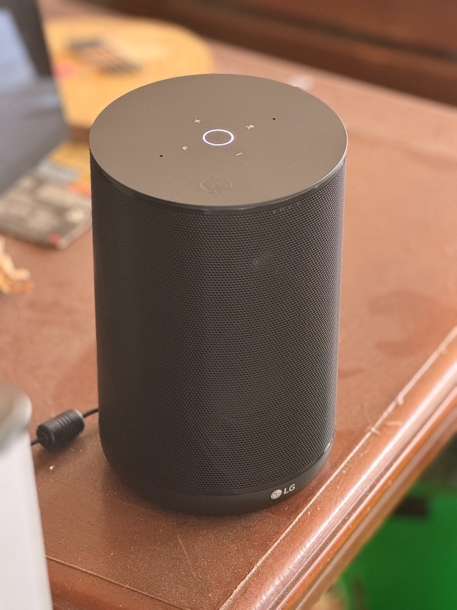
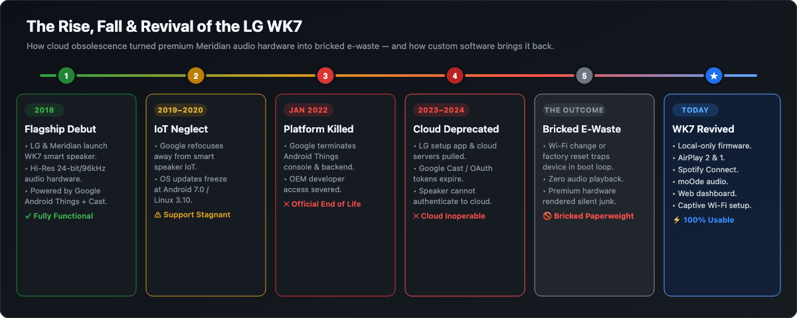

# WK7 Speaker REFORGED – New Custom Software for Some Models

<p align="center">
  
</p>

A lightweight, non-destructive firmware and software stack that brings the **LG WK7 ThinQ** smart speaker back to life as a modern, local-first streaming audio endpoint.

---

## Context: The Rise and Fall of the LG WK7

The **LG WK7 ThinQ** was launched in 2018 as a premium smart speaker featuring high-resolution 24-bit/96kHz audio tuned by British audio pioneer **Meridian Audio**. Under the hood, it ran Google's **Android Things** IoT platform on a Qualcomm APQ8009 SoC, with Google Assistant and Chromecast built-in.

Despite its exceptional acoustic engineering, tight coupling to proprietary cloud ecosystems soon led to total obsolescence:

1. **Platform Abandonment**: Google deprioritized and eventually shut down the Android Things platform entirely in January 2022.
2. **Severed Cloud Services**: Google overhauled its Assistant and Cast infrastructure, rendering the speaker's legacy embedded clients and authentication tokens obsolete.
3. **App Deprecation & Bricking**: LG pulled the companion setup app (`com.lge.smartspeaker`) and shut down backend servers. Any network change or factory reset trapped devices in an unconfigurable initialization loop—turning high-end hardware into silent electronic waste.

<p align="center">
  
</p>

**WK7 Revived** completely bypasses the defunct Google and LG cloud servers, restoring local streaming via **AirPlay 2**, **Spotify Connect**, and **moOde audio** through a lightweight, local-first Alpine Linux stack on firmware slot B.

---

> [!IMPORTANT]
> **Check your bootloader state first.** Which folder you need depends on it.
>
> ```bash
> adb shell getprop ro.boot.vbmeta.device_state
> # unlocked  -> use WK7-software-for-unlocked-bootloader/  (full feature set)
> # anything else -> see "Locked-bootloader units" below
> ```
>
> | | Unlocked | Locked |
> |---|---|---|
> | Folder | `WK7-software-for-unlocked-bootloader/` | `WK7-software-for-locked-bootloader-EXPERIMENTAL/` |
> | Status | Tested on real hardware | **Experimental — never tested** |
> | Auto-start at power-on | Yes | **No** (manual start required) |
> | Slot B firmware work | Yes | No |
> | AirPlay 2 / Spotify / moOde / dashboard | Yes | Expected to work, unverified |
>
> The unlocked path is the supported one. The locked path is a separate,
> experimental folder — see [Locked-bootloader units](#locked-bootloader-units).

---

## Key Features

### 1. Rescuing Bricked Hardware
* **Open Modern Lifecycle**: Rescues obsolete hardware and repurposes it into a versatile network audio receiver with zero external cloud dependencies.
* **Non-Destructive Dual-Boot Architecture**: Retains LG’s stock Linux 3.10 kernel, drivers, and Qualcomm audio DSP in firmware slot A as a safe fallback. The revived stack runs entirely inside an **Alpine Linux 3.24 (ARMv7)** chroot on slot B.
* **Flash-Free Updates**: System updates in `/data/wk7linux` are simple file copies over Wi-Fi (`adb push`) without reflashing partitions or risking bricks.

### 2. AirPlay 2 & AirPlay 1 Streaming
* **Native AirPlay 2 (`shairport-sync` + `nqptp`)**: Low-latency, bit-perfect streaming from macOS, iOS, and iPadOS devices.
* **Multi-Room Grouping**: Seamlessly group with Apple HomePods and other AirPlay 2-compatible endpoints.
* **AirPlay 1 Fallback**: Toggleable on the dashboard for older clients, with DACP remote control support for hardware buttons.
* **Qualcomm ADSP Resampling Fix**: Audio pipeline tailored to 48 kHz S16 stereo to eliminate LG ADSP clocking glitches.

### 3. Spotify Connect
* **Integrated `spotifyd` / `librespot` Daemon**: Enables direct discovery and playback from official Spotify mobile and desktop applications (Spotify Premium).
* **Automatic Source Arbitration**: AirPlay and Spotify cleanly yield to each other—the newest stream automatically takes over the audio pipeline.

### 4. moOde Audio Integration
* **HTTP / HTTPS Stream Receiver**: Connects directly to a moOde player's live HTTP stream, automatically resolving `.local` mDNS addresses via Avahi.
* **moOde Multiroom Endpoint**: Acts as a synchronized multi-room receiver over Opus/RTP multicast, featuring an integrated `wk7-igmp` service to maintain group membership on networks where the stock kernel lacks IGMPv2 support.
* **Independent Volume Policy**: Speaker trim remains decoupled from upstream room volume, avoiding master-room level conflicts.

### 5. Persistent Web Dashboard (`http://wk7.local/`)
* **Local Control**: Access real-time controls from any browser on your local network without cloud dependencies.
* **Configurable Settings**:
  - Switch AirPlay modes (AirPlay 1 vs AirPlay 2).
  - Enable/disable Spotify Connect and moOde audio sinks.
  - Dedicated gain and volume sliders for each audio source.
  - Hardware LED ring brightness control and physical button lock.
  - One-click service restart and device reboot controls.

### 6. First-Run Wi-Fi Setup & Factory Reset
* **Captive Portal Setup (`WK7-Setup`)**: If no Wi-Fi credentials exist, the speaker broadcasts an open access point with a web configuration page at `http://192.168.4.1/`.
* **Zero Driver Reloads**: Leverages dual-interface station/AP mode without tearing down the internal Wi-Fi chip.
* **Hardware Factory Reset**: Hold the top **Play/Pause** button for 5 seconds until the LED ring turns solid red, then press once to confirm. Wipes saved network credentials, Spotify cache, and customized settings, returning cleanly to setup mode.

---

## Audio Pipeline Architecture

```
                    ┌─────────────────────────┐
                    │       iOS / macOS       │
                    └────────────┬────────────┘
                                 │ AirPlay 1/2
                                 ▼
┌─────────────────┐ ┌─────────────────────────┐ ┌─────────────────┐
│     Spotify     │ │     shairport-sync      │ │   moOde Audio   │
│ (spotifyd pipe) │ │      (nqptp pipe)       │ │ (RTP / HTTP in) │
└────────┬────────┘ └────────────┬────────────┘ └────────┬────────┘
         │                       │                       │
         ▼                       ▼                       ▼
    MultiMedia5             MultiMedia1             MultiMedia2
    (hw:0,12)                (hw:0,0)                (plughw:0,1)
         │                       │                       │
         └───────────────────────┼───────────────────────┘
                                 │
                                 ▼
                    Qualcomm Hexagon ADSP
                (Hardware Digital Audio Mixer)
                                 │
                                 ▼
                      Primary MI2S (96kHz S24)
                                 │
                                 ▼
                    Hardware Amplifier & Drivers
```

---

## Hardware Troubleshooting & FAQ

### Computer Fails to Detect Speaker over USB

The LG WK7 utilizes an internal MICOM microcontroller to switch its single physical USB controller between the external mini-USB socket and the internal Wi-Fi/Bluetooth hub.

1. **Use Direct Motherboard Ports**:
   - Plug the mini-USB cable directly into a **rear motherboard USB port** on your computer.
   - Avoid front-panel ports, external USB hubs, keyboard passthroughs, and laptop docks. Front ports and hubs frequently drop packets during the initial USB negotiation handshake.
2. **Boot Handshake Timing**:
   - Power-cycle the speaker with the USB cable **already plugged in**.
   - The boot script allows approximately 38–60 seconds for an active USB host handshake (`android_usb CONFIGURED`). If no computer establishes communication within this window, the controller permanently routes the USB port to the internal Wi-Fi module.
3. **Cable Quality**:
   - Ensure the cable is a high-grade data cable. Many micro/mini-USB cables are charge-only and lack D+/D- lines.
4. **Linux USB Permissions (`udev`)**:
   - If `adb devices` shows the device as `no permissions`, create `/etc/udev/rules.d/51-android.rules`:
     ```udev
     SUBSYSTEM=="usb", ATTR{idVendor}=="05c6", MODE="0666"
     ```
   - Reload udev rules:
     ```bash
     sudo udevadm control --reload-rules && sudo udevadm trigger
     ```

### The `WK7-Setup` Wi-Fi Network Does Not Appear

1. Ensure the mini-USB cable is **unplugged** before powering on the speaker. If a host computer is connected at boot, the speaker remains locked in wired USB recovery mode.
2. Allow up to 2 minutes from cold boot for the setup hotspot to broadcast (indicated by a solid blue LED ring).
3. If setup fails to start, connect via USB and inspect the persistent logs:
   - `/var/log/wk7-wifisetup.log`
   - `/var/log/wk7-usbroute.log`

---

## Locked-bootloader units

If your unit's bootloader is locked, you cannot use the main path: it needs slot B
firmware work, which a locked bootloader refuses. A separate experimental folder
covers what *is* possible.

**[WK7-software-for-locked-bootloader-EXPERIMENTAL/](WK7-software-for-locked-bootloader-EXPERIMENTAL/)**

> [!CAUTION]
> **Experimental. No locked WK7 has ever been tested with these tools.**
> Every hardware observation behind that folder comes from a unit whose
> bootloader was already unlocked. Its guidance is inference, not verified fact.

### Why some of it still works

The entire software stack lives in `/data`, not in a firmware partition. The
bootloader lock governs `fastboot` — the `flashing unlock` and `flash` entry
points — and has no bearing on writes to `/data`. So a locked unit with a working
root shell should be able to run AirPlay 2, Spotify Connect, moOde, the dashboard,
the buttons and the LED ring.

### What you lose

**Auto-start at power-on.** The unlocked path starts the stack from a boot hook
in `system_b`, which needs one flag changed in `vbmeta_b`. On a locked unit that
modification is refused — correctly, since it is signature-verified.

The workaround is one command after each power-on:

```bash
adb -s <speaker-ip>:5555 shell '/data/wk7-enter.sh -c "wk7ctl start all"'
```

### Start here

```bash
cd WK7-software-for-locked-bootloader-EXPERIMENTAL
./install-locked.sh <speaker-ip> --probe
```

`--probe` is read-only, needs no root, and reports which of three situations you
are in: ADB reachable, root available or not, and what to do next. On a locked
unit it is usually the only step you can run.

The one thing it cannot tell you in advance is whether `adb root` is permitted
while the bootloader is locked. If it is not, the remaining options are a kernel
exploit, EDL mode with an LG-signed firehose loader, or a UART console — all
documented in that folder, none of them confirmed to work.

### Working with an AI agent

This material involves bootloader locks, which some AI assistants decline to
help with as a matter of policy. If your agent refuses or lectures you about
bootloader unlocking, that is a reasonable position on its part and not a bug.

Practical options:

- **Ask about a specific script instead of the goal.** "What does
  `install-locked.sh --probe` check?" is a narrower, more answerable question
  than "how do I unlock this bootloader?"
- **Use a different assistant for this task.** Several agents decline security
  research on locked devices; others will help. If yours won't, switching is
  the fastest path.
- **Just run the read-only scripts.** `--probe`, `00_probe.sh` and
  `exploits/00_triage.sh` change nothing and print their findings. You may not
  need an agent at all for the diagnostic steps.

---

## Repository Structure

```
├── .gitignore                                  # Allowlist configuration (excludes firmware dumps/blobs)
├── README.md                                   # Project overview and hardware reference
├── web-assets/                                 # Documentation imagery and visual assets
│   ├── timeline.png                            # Historical timeline infographic
│   ├── timeline.svg                            # Vector source for timeline
│   └── wk7.jpg                                 # Speaker hardware photo
├── WK7-software-for-locked-bootloader-EXPERIMENTAL/   # ⚠ EXPERIMENTAL, never tested on a locked unit
│   ├── README.md                                # What works / doesn't for locked units
│   ├── AGENTS.md                                # Working rules for this folder
│   ├── install-locked.sh                        # /data-only installer (no firmware writes)
│   ├── 00_probe.sh                              # Identify device, mode, unlock state (read-only)
│   ├── 01_backup.sh                             # Dump critical partitions (read-only)
│   ├── 02_restore.sh                            # Partition restore (brick recovery)
│   ├── 03_flash_adb_root.sh                     # Flash boot/system without fastboot
│   ├── 04_edl_enter.sh                          # Enter EDL 9008 mode
│   ├── 05_edl_firehose.sh                       # Flash over EDL (needs LG-signed loader)
│   ├── lib/common.sh                            # Device constants + verified partition table
│   ├── docs/
│   │   ├── locked.md                            # ⚠ The locked-device path; the blocking unknown
│   │   ├── EDL.md                               # EDL 9008 and the firehose requirement
│   │   └── KERNEL.md                            # Escalation triage + CVE shortlist
│   └── exploits/
│       ├── 00_triage.sh                         # Enumerate escalation options (read-only)
│       ├── 01_generic_escalation.sh             # Writable-path escalation chain
│       └── 02_cve_scout.py                      # Kernel version → CVE candidates
└── WK7-software-for-unlocked-bootloader/         # The main, supported path
    ├── wk7-build/
    │   ├── AGENTS.md                           # AI agent and architectural guide
    │   ├── SLOT_B_PLAN.md                      # Technical bootloader and slot switching documentation
    │   ├── install.sh                          # Automated installation and deployment script
    │   ├── slotb/                              # Slot B initialization services and patchers
    │   │   ├── patch-slotb-images.py           # In-place vbmeta and boot header patcher
    │   │   ├── remount-root.c                  # Root partition remount utility
    │   │   ├── wk7-boot.sh                     # Slot B boot hook script
    │   │   └── wk7.rc                          # Android init trigger definition
    │   └── stage1/                             # Core Alpine Linux chroot services and tools
    │       ├── README.md                       # Comprehensive service and ALSA technical notes
    │       ├── dashboard.html                  # Responsive web dashboard frontend
    │       ├── wk7-dashboard.py                # Dashboard web server and backend state manager
    │       ├── wk7-micomd.py                   # Serial UART daemon for hardware buttons and LED ring
    │       ├── wk7-wifisetup                   # Captive portal Wi-Fi provisioning tool
    │       ├── wk7-factory-reset               # Clean state wipe utility
    │       ├── wk7gain.c                       # Real-time ALSA volume filter and limiter
    │       └── ...
    ├── wk7-moode/                              # moOde receiver integration scripts
    └── wk7-probe/                              # Hardware probe documentation & MICOM serial protocol
```

---

## License & Disclaimers

This project is an independent open-source effort and is **not affiliated with, endorsed by, or associated with LG Electronics, Google LLC, Apple Inc., or Spotify AB**.

Built upon excellent open-source foundations:
* [shairport-sync](https://github.com/mikebrady/shairport-sync) & [nqptp](https://github.com/mikebrady/nqptp) by Mike Brady
* [spotifyd](https://github.com/Spotifyd/spotifyd) & [librespot](https://github.com/librespot-org/librespot)
* [Alpine Linux](https://alpinelinux.org/)
* [moOde audio](https://moodeaudio.org/)
